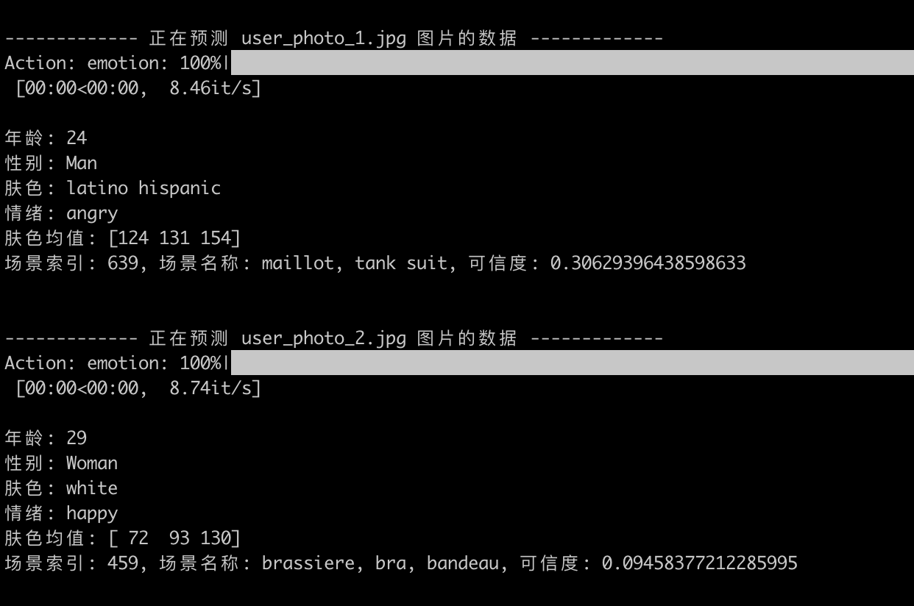

# DeepFace_Info
解析人脸信息，例如年龄、性别、肤色、情绪

# 环境配置

###### 可以直接通过 conda 创建环境，便于管理，没有安装 conda 请自行安装，如果不想创建虚拟环境也可跳过该步骤
 ```
 conda create -n py && conda activate py
 ```
 # 依赖说明
 ```
deepface
torch 
torchvision
opencv-python
 ```

# 使用说明

```
cd 到项目目录
pip install -r requirements.txt
```

### 方式一：直接使用 detection 进行解析
1. 先将需要解析的图片放到 `images` 目录下
2. 运行`python only_detection.py`

### 方式二：通过 main 执行随机挑选后，再进行 detection 解析
1. 先将海量的图片放到 `input` 目录下
2. 运行`python copy_and_detection.py`
    说明：main 会先执行 `copy_random_images`，对 `input` 目录下的图片随机挑选 3000 张图片，并将其复制到 `images` 目录下，同时将图片转为`jpg`格式并压缩，然后执行 `detection_add_chart.py`

# 运行效果


